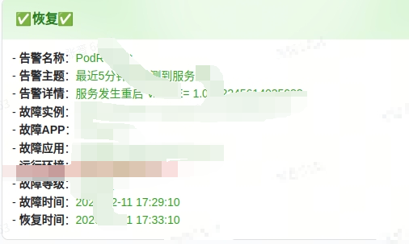

# AlertManager to Feishu Bot

AlertManager to Feishu Bot 是一个用于接收 Prometheus AlertManager 的告警消息并将其转发到飞书机器人的中间件应用。

## 功能特性

- 支持 AlertManager 告警信息转换为飞书消息卡片格式
- 显示告警名称、主题、详情、实例、故障APP、故障应用等关键信息
- 支持运行环境标识和故障等级显示
- 自动识别时区并确保时间戳准确性
- 可配置日志级别和多种运行参数
- 飞书消息签名验证支持

## 环境要求

- Python >= 3.7
- Docker (如果选择 Docker 部署)

## 快速启动

### 方式一：Docker 部署（推荐）

#### 使用已有镜像运行

```bash
docker run -d -p 9527:9527 \
  -e FEISHU_WEBHOOK="https://open.feishu.cn/open-apis/bot/v2/hook/your-webhook-url" \
  -e FEISHU_SECRET="your-feishu-secret" \
  --name alertmanager-feishu-webhook \
  your-docker-image-name:latest
```

#### 本地构建并运行

```bash
docker build -t alertmanager-feishu-webhook . --no-cache
docker run -d -p 9527:9527 \
  -e FEISHU_WEBHOOK="https://open.feishu.cn/open-apis/bot/v2/hook/your-webhook-url" \
  -e FEISHU_SECRET="your-feishu-secret" \
  --name alertmanager-feishu-webhook \
  alertmanager-feishu-webhook
```

### 方式二：直接通过本地Python启动

首先升级 Python 至 3.7 以上（如已安装请跳过）

安装依赖包：

```bash
pip install --no-cache-dir flask requests gunicorn tenacity
```

运行脚本：

```bash
# 使用默认端口和配置启动
python alertmanager_feishu_webhook.py
```

也可以通过以下环境变量进行自定义配置：

```bash
# 指定端口号
export PORT=9527

# 配置飞书机器人相关信息
export FEISHU_WEBHOOK="https://open.feishu.cn/open-apis/bot/v2/hook/your-webhook-url"
export FEISHU_SECRET="your-feishu-secret"

# 可选配置
export RUN_ENVIRONMENT="生产环境" # 显示运行环境信息
export LOG_LEVEL="INFO" # 设置日志级别：DEBUG, INFO, WARNING, ERROR, CRITICAL

python alertmanager_feishu_webhook.py
```

## 配置说明

| 环境变量        | 类型 | 默认值 | 描述                             |
| --------------- | ---- | ------ | -------------------------------- |
| FEISHU_WEBHOOK  | 必须 | 无     | 飞书机器人的Webhook URL          |
| FEISHU_SECRET   | 必须 | 无     | 飞书机器人的密钥，用于签名验证   |
| PORT            | 可选 | 9527   | 服务运行端口                     |
| RUN_ENVIRONMENT | 可选 | ""     | 运行环境名称，将在告警信息中显示 |
| LOG_LEVEL       | 可选 | INFO   | 日志输出级别                     |

## 测试部署

测试连接：

```bash
# 直接使用 test.sh 测试
sh test.sh
# 注意：请先修改 test.sh 中的URL为您的实际服务地址和端口
```

或直接使用curl测试健康检查接口：

```bash
curl http://localhost:9527/health
```

## 配置 AlertManager 路由

在 AlertManager 的 `alertmanager.yml` 配置文件中添加以下配置：

```yaml
route:
  receiver: "feishu"
  group_wait: 30s
  group_interval: 5m
  repeat_interval: 3h

receivers:
  - name: "feishu"
    webhook_configs:
      - url: "http://your-server-ip:9527/webhook"
        send_resolved: true

inhibit_rules:
  - source_match:
      severity: "critical"
    target_match:
      severity: "warning"
    equal: ["alertname", "dev", "instance"]
```

其中:

- `send_resolved: true` 表示开启恢复通知
- 只有在触发器状态变成 `resolved` 后且满足抑制条件才会发出恢复通知

## 支持的消息类型

本服务会接收AlertManager的通知事件，根据告警状态处理：

- **FIRING** (`firing`): 发送"🚨告警"消息，标记为红色
- **RESOLVED** (`resolved`): 发送"✅恢复"消息，标记为绿色

告警消息会包含以下信息：

- 告警名称
- 告警主题
- 告警详情
- 故障实例
- 故障APP (来自 labels.namespace)
- 故障应用 (来自 labels.pod)
- 故障等级 (来自 labels.severity，可选)
- 运行环境 (来自环境变量 RUN_ENVIRONMENT，可选)
- 故障时间
- 恢复时间（如果是恢复消息）

## 效果展示


## 状态API

服务提供健康检查接口，可检查应用运行状态：

- `GET /health` - 返回简单的 ok 响应，适合用作健康检查
- `POST /webhook` - AlertManager 告警接收接口
